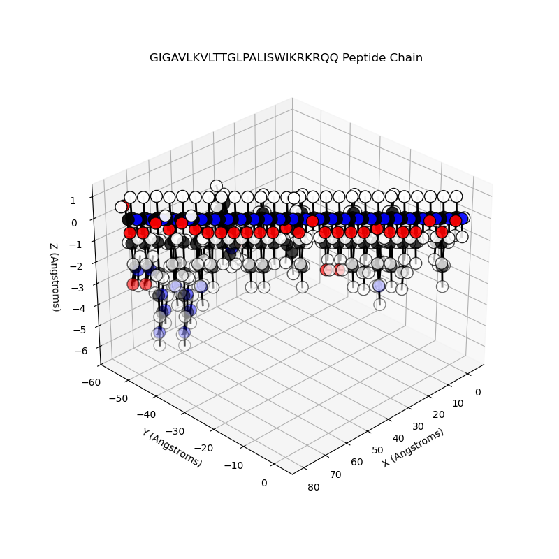

# Peptide Builder

## Description
This is a Python API that builds a peptide chain from one-letter-sequences of amino acids through the data extraction of CIF files for residues. It is comprised of three main files: starting.py, residue.py, and peptide.py. The starting.py file parses the data found in the CIF file using gemmi. The residue.py file creates a Residue class based on parsed data and includes methods that assist with peptide building. The peptide.py file builds and visualizes a peptide chain through altering and combining various Residue class objects based on the sequence of amino acids. The data folder includes all of the CIF files necessary for building peptides.

## Instructions
1. Create new environment and install required libraries with
    ```make environment```
    - You can also install these libraries with pip if you do not have conda installed
2. Activate new environment with
    ```conda activate peptide_builder```
3. Visualize the melittin peptide with
    ```make visualize```
4. If you want to visualize a different peptide, you can reference the demo.py file to see the process and access different attributes and properties of the atoms, residues, and peptide.



